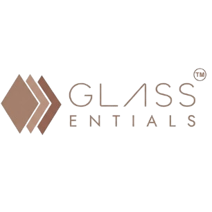

  
  <h1>GlassEntials Premium HRMS</h1>
  
<strong>Next-Generation Enterprise Human Resource Management Platform</strong>

---

## 🏢 Executive Overview

**GlassEntials HRMS** is an enterprise-grade Human Resource Management ecosystem engineered to streamline workforce administration, optimize attendance logistics, and automate the payroll lifecycle. Built upon a highly secure Django backend and a state-of-the-art "Glassmorphic" frontend, the platform delivers high-performance data processing wrapped in a premium, fluid user experience.

Designed exclusively for organizational scale, GlassEntials empowers administrative teams to transition from manual operational friction to strategic workforce optimization.

---

## 🌟 Core Modules

### 👥 Unified Employee Infrastructure
- **Centralized Command Center**: Holistic, real-time view of all employee lifecycles, structured by organizational hierarchy (Departments, Teams, Designations).
- **Automated Ingestion Pipelines**: Mass data onboarding via intelligent bulk Excel/CSV imports with strict pre-validation parameters.
- **Dynamic Access Control**: Secure, role-based architectural boundaries safeguarding highly sensitive PII (Personally Identifiable Information).

### 🕒 Advanced Workforce Logistics
- **Intelligent Shift Engineering**: Granular shift configurations supporting multi-day night-shifts, dynamic grace periods, and complex half-day/full-day automated threshold calculations.
- **Conflict-Aware Allocations**: Intelligent assignment matrices that algorithmically prevent schedule overlaps and map precise effective date ranges.
- **Historical Data Integrity**: Immutable audit trails utilizing soft-deletion methodologies to guarantee uncompromising historical compliance for payroll and taxation.

### 💰 Financial & Leave Processing
- **Leave Matrices**: Automated accrual tracking, transparent balance dashboards, and policy-driven approval workflows.
- **Payroll Automation**: Seamless integration bridging raw attendance telemetry with complex compensation structures for rapid, error-free payout cycles.

---

## 🏛️ System Architecture & Infrastructure

GlassEntials is engineered on a robust technology stack prioritizing maintainability, data integrity, and high-availability enterprise deployment.

| Domain | Core Technology / Standard |
| :--- | :--- |
| **Application Framework** | Python 3.x, Django 5.x Architecture |
| **Data Persistence** | Relational Database Management (PostgreSQL/Enterprise standard) |
| **Frontend Engine** | HTML5, Vanilla CSS3 (Custom Design System), JS Interactivity |
| **Typography & Iconography**| Plus Jakarta Sans, Manrope, FontAwesome 6 Pro |
| **Data Validation** | Server-Side Rendering (SSR) with strictly typed backend validations |

---

## 🎨 The "Glassmorphic" Design Standard

We believe enterprise software should not be visually sterile. GlassEntials implements a highly tailored **Premium Glassmorphic Design Language** to enhance user productivity:
- **Spatial UI Architecture**: Utilizes advanced `backdrop-filter` rendering and multi-layered translucency to establish distinct visual hierarchy.
- **Cognitive Ease**: Strategic deployment of curated color tokens mapping specifically to system states, drastically reducing administrative fatigue.
- **Fluid Micro-Interactions**: Physics-based hover states and transitions that provide immediate, tactile system feedback.
- **Cross-Platform Consistency**: Bulletproof form controls (e.g., enforced flatpickr 12-hour localization) ensuring zero data-entry friction across varied operating environments.

---

  
<em>© 2026 GlassEntials Platform. Internal Enterprise Documentation. Confidential & Proprietary.</em>

