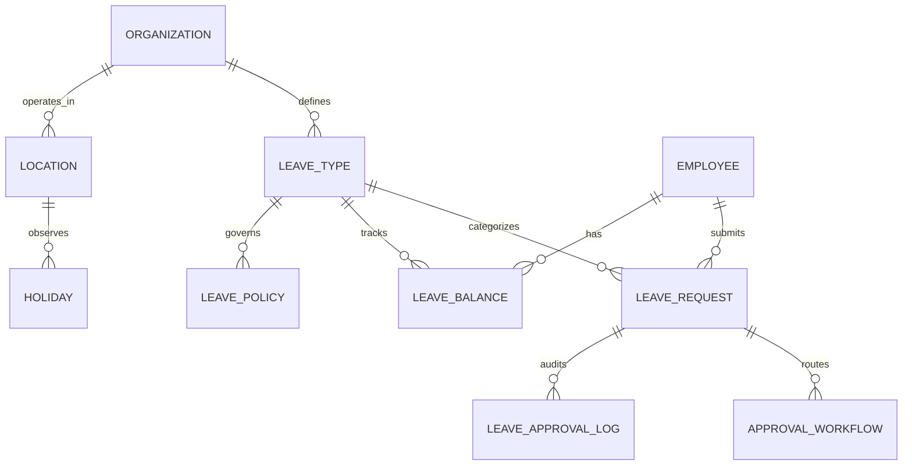

# Enterprise Leave Management: Normalized Database Schema

This document defines the 3rd Normal Form (3NF) database architecture for the Global LMS.

## 1. Entity Relationship Diagram (ERD)

## 2. Table Definitions

### 2.1 Core Organizational Data
#### `Organization` (Existing)
- `id` (PK)
- `name`
- `unique_code`

#### `Location`
- `id` (PK)
- `organization_id` (FK)
- `name` (e.g., "New York Office", "Mumbai HQ")
- `timezone`
- `country_code` (ISO 3166-1 alpha-2)

### 2.2 Policy & Logic
#### `LeaveType`
- `id` (PK)
- `organization_id` (FK)
- `name` (e.g., "Annual Leave")
- `code` (e.g., "AL")
- `is_paid` (Boolean)
- `is_statutory` (Boolean)

#### `LeavePolicy`
- `id` (PK)
- `leave_type_id` (FK)
- `organization_id` (FK)
- `accrual_rate` (Decimal: Days per month)
- `max_balance` (Integer)
- `carry_forward_limit` (Integer)
- `min_service_days` (Integer: Days of employment required before use)
- `sandwich_rule` (Boolean: Count weekends/holidays if leave is taken around them)
- `requires_attachment` (Boolean)
- `attachment_threshold_days` (Integer: Requires doc if leave > N days)

### 2.3 Employee State
#### `LeaveBalance`
- `id` (PK)
- `employee_id` (FK)
- `leave_type_id` (FK)
- `year` (Integer)
- `current_balance` (Decimal)
- `used_balance` (Decimal)
- `pending_balance` (Decimal: Days currently in 'Pending' requests)

#### `LeaveAccrualLog`
- `id` (PK)
- `employee_id` (FK)
- `leave_type_id` (FK)
- `amount` (Decimal)
- `action_type` (Enum: ACCRUAL, MANUAL_ADJUSTMENT, CARRY_FORWARD, ENCASHMENT)
- `description`
- `created_at`

### 2.4 Transactional Data
#### `LeaveRequest`
- `id` (PK)
- `employee_id` (FK)
- `leave_type_id` (FK)
- `start_date` (Date)
- `end_date` (Date)
- `session_type` (Enum: FULL, MORNING, AFTERNOON)
- `total_days` (Decimal)
- `reason` (Text - Encrypted)
- `status` (Enum: DRAFT, PENDING, MANAGER_APPROVED, APPROVED, REJECTED, CANCELLED)
- `attachment_path` (String)

#### `ApprovalWorkflow`
- `id` (PK)
- `leave_request_id` (FK)
- `approver_id` (FK to User)
- `sequence_order` (Integer: Level 1, Level 2, etc.)
- `status` (Enum: PENDING, APPROVED, REJECTED)
- `action_date` (DateTime)
- `comments` (Text)

## 3. Normalization Strategy (3NF)

1.  **First Normal Form (1NF)**:
    - All tables have a Primary Key.
    - All attributes are atomic (e.g., `Reason` is a single text block, not a comma-separated list of sub-reasons).
    - No repeating groups (e.g., instead of `Manager1_ID`, `Manager2_ID` in `LeaveRequest`, we use the `ApprovalWorkflow` table).

2.  **Second Normal Form (2NF)**:
    - All non-key attributes are fully functionally dependent on the Primary Key.
    - Example: `LeavePolicy` is separated from `LeaveType` because policies can vary by organization/location even if the "Type" (e.g., Sick Leave) is the same.

3.  **Third Normal Form (3NF)**:
    - No transitive dependencies.
    - Example: `Location` details (Timezone, Country) are stored in the `Location` table, not in the `Employee` table. The `Employee` table only links to `LocationID`.

## 4. Performance & Scalability
- **Indexing**: Composite indexes on `(employee_id, leave_type_id, year)` for fast balance lookups.
- **Partitioning**: `LeaveAccrualLog` and `ApprovalWorkflow` can be partitioned by `created_at` (year/month) as they grow into millions of rows.
- **Soft Deletes**: All tables implement `is_deleted` and `deleted_at` to preserve audit trails while maintaining UI cleanliness.
