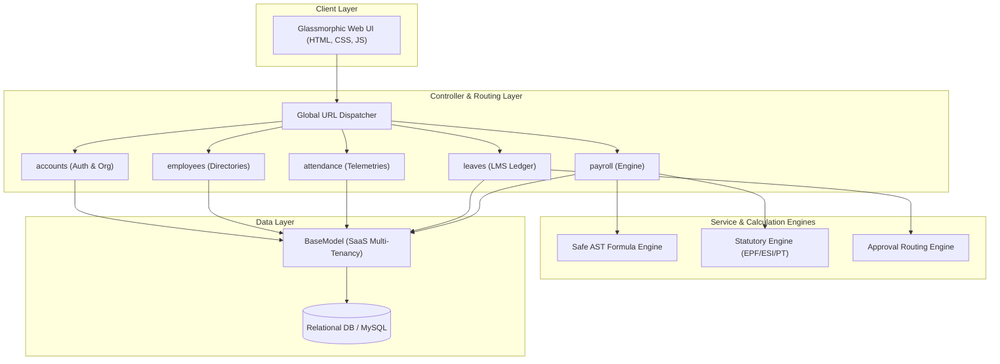
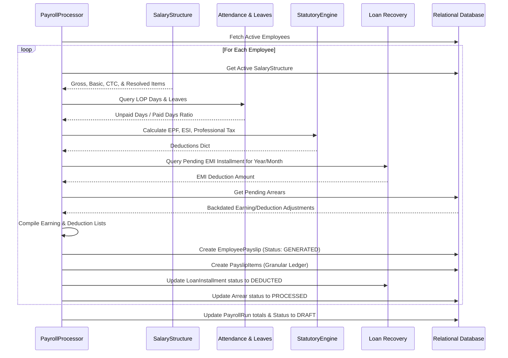

# 💎 GlassEntials Premium HRMS: Comprehensive Architectural & Technical Review

This document contains a comprehensive review of the **GlassEntials Premium HRMS** platform. The system is evaluated for architectural robustness, data integrity, security, multi-tenancy isolation, and operational performance.

---

## 🏛️ 1. Executive Architectural Assessment

GlassEntials is designed as an enterprise-grade, multi-tenant software-as-a-service (SaaS) workforce management system. 



### Key Architectural Strengths:
1. **Clean Modular Boundaries**: Responsibilities are strictly segregated across well-defined Django apps:
   - `accounts`: Identity and Organization (Tenant) provisioning.
   - `employees`: Workforce hierarchy and employee profiles.
   - `attendance`: Direct workforce telemetry, shifts, and correction logs.
   - `leaves`: Normalized, rule-driven leave accounts and sequence-aware workflow routing.
   - `payroll`: Appraisal-tracked salary configurations, statutory engines, and installment amortization.
2. **Immutable Audit Trails**: The use of custom soft-delete architectures (`is_deleted`, `deleted_at`) in `BaseModel` ensures historical records are retained—crucial for payroll and tax audits.
3. **High-Security Extensibility**: The payroll calculation engine leverages Python’s **Abstract Syntax Tree (AST)** for formula parsing rather than a risky `eval()`, establishing a sandbox for runtime formula execution.

---

## 🚨 2. Critical Vulnerability: Multi-Tenancy Data Isolation Leak

While the database layer defines a robust multi-tenancy core via `BaseModel` and its `organization` foreign key, **the current implementation contains severe cross-tenant data leak vulnerabilities in the view and creation layer.** 

Below are the audited points of leakage, categorized by severity:

### 🔴 High Severity: Unrestricted Global Employee Leakage
In `employees/views.py` ([employee_view](file:///d:/projects/HRMS_Glassentials/employees/views.py#L19-L71)), the query fails to filter by the user's organization:
```python
# Line 19: Queries ALL active, non-deleted employees in the database!
employees_list = Employee.objects.filter(is_deleted=False).order_by('-created_at')
```
An HR/Admin user logged into **Tenant A** can view, filter, paginate, and count stats for employees belonging to **Tenant B**, **Tenant C**, and the rest of the SaaS ecosystem.

### 🔴 High Severity: Cross-Tenant Organization Creation Failure
When creating departments, designations, and employees, the code fails to pass the current user's organization. As a result, these records are saved with `organization = None` (global/orphaned state):
1. **`Department` Creation** ([views.py:L175-179](file:///d:/projects/HRMS_Glassentials/employees/views.py#L175-L179)):
   ```python
   Department.objects.create(
       name=name, 
       description=description,
       created_by=request.user  # organization is missing! Set to None!
   )
   ```
2. **`Designation` Creation** ([views.py:L265-270](file:///d:/projects/HRMS_Glassentials/employees/views.py#L265-L270)):
   ```python
   Designation.objects.create(
       name=name, 
       description=description,
       department_id=dept_id,
       created_by=request.user  # organization is missing! Set to None!
   )
   ```
3. **`Employee` Creation** ([views.py:L314-356](file:///d:/projects/HRMS_Glassentials/employees/views.py#L314-L356)):
   ```python
   employee = Employee(
       employee_id=request.POST.get('employee_id'),
       ...
       created_by=request.user  # organization is missing! Set to None!
   )
   ```
4. **`Bulk Employee Import`** ([views.py:L744-757](file:///d:/projects/HRMS_Glassentials/employees/views.py#L744-L757)):
   ```python
   Employee.objects.create(
       employee_id=emp_id,
       ...
       created_by=request.user  # organization is missing! Set to None!
   )
   ```

### 🔴 High Severity: Case-Insensitive Global Uniqueness Restores
In `department_view` and `designation_view`, unique validation queries check records globally:
```python
# Checks all tenants! Will prevent Tenant B from creating a department if Tenant A has it.
existing_dept = Department.objects.filter(name__iexact=name).first()
```
If a department with the same name is deleted in **Tenant A**, and **Tenant B** tries to create it, **Tenant B** will restore and hijack **Tenant A's** deleted department, moving it between tenants.

---

## 🔍 3. Module-by-Module Code Review

### 👥 A. Unified Employee Infrastructure (`employees`)
* **Strengths**: 
  - Standardized Excel export with custom styles (`openpyxl`), auto-adjusting column widths, and visually distinct active/inactive tags.
  - Comprehensive field mapping covering emergency contacts, profile images, and legal records (PAN, Aadhaar).
* **Weaknesses**:
  - Missing field-level validations for phone numbers (requires regex limit) and Aadhaar/PAN formats on the server side.

### 🕒 B. Advanced Workforce Logistics (`attendance`)
* **Strengths**:
  - Overlap prevention algorithm within `ShiftAssignment.clean()` prevents schedule conflicts.
  - Granular tracking of break times through a dedicated `BreakLog` sub-table, adjusting gross hours to yield a reliable `net_work_hours`.
  - The calendar builder uses Python’s native calendar matrix, making it easy to map weekends and holidays.
* **Weaknesses**:
  - Clock-in grace periods and late minutes assume start times never wrap around midnight. For `is_night_shift=True`, standard time deltas will yield extreme calculation errors if clocks cross `00:00:00`.
  - Shift deactivation is linked to designations but lacks warning indicators if deactivating active shifts for currently assigned personnel.

### 💰 C. Leaves & Workflows Ledger (`leaves`)
* **Strengths**:
  - **3NF Database Normalization**: Perfect normalization of `Location` -> `Holiday` -> `LeaveType` -> `LeavePolicy`. Policies cleanly decouple rules from types.
  - **Dynamic Workflow Matrices**: Generates sequence-ordered multi-step chains (`ApprovalWorkflow`) mapping dynamically to manager hierarchies or specific department roles.
  - **Optional & Short Leaves**: Solid business rule implementations for Short Leaves (max 2/month, 0.25 day deduction value) and Restricted Holidays (RH Claims with balance limits).
* **Weaknesses**:
  - **State Loss on Cancellation**: During leave cancellation approvals, the system attempts to restore leave balances only if the request was previously approved:
    ```python
    was_approved = ApprovalWorkflow.objects.filter(leave_request=leave_req, status='APPROVED').exists()
    ```
    However, if a multi-step approval workflow is approved by a manager (state `MANAGER_APPROVED`) but not yet fully `APPROVED`, it hasn't deducted balance yet. Reverting it will work, but using workflow logs for state checks is fragile. The system should store the previous transaction state or balance delta explicitly.

### 💎 D. Enterprise Payroll & Statutory Engine (`payroll`)
The payroll architecture is exceptionally mature, incorporating rigorous computational guards and audit protections.



* **Strengths**:
  - **AST-Safe Execution**: `SafeFormulaRunner` isolates runtime mathematical evaluation safely without the risk of code injection.
  - **Appraisal Revision Tracks**: Revisions to `SalaryStructure` auto-terminate the previous open revision, avoiding overlapping payroll cycles.
  - **Comprehensive Integrations**: Handles backdated Arrears, Loan recovery schedules, and statutory caps (EPF ₹15,000 ceiling; ESI ₹21,000 ceiling).
* **Weaknesses**:
  - **Hardcoded State Rules**: PT (Professional Tax) is hardcoded to a simplified Maharashtra rule in Python. Slab rules should be moved to dynamic DB models.
  - **Simplified LOP Calculations**: LOP is derived via `_get_lop_days` using a simplified attendance query count. It does not factor in half-days or approved unpaid leaves seamlessly.

---

## 📈 4. Performance & Scalability Assessment

### Indexing Check
The indexes defined across the apps are strategically placed:
- `SalaryStructure`: Composite index on `(employee, effective_date)` maps perfectly to historical package retrieval queries.
- `EmployeePayslip`: Composite index on `(payroll_run, employee)` accelerates payslip rendering during batch evaluations.
- `LeaveBalance`: Composite index on `(employee, leave_type, year)` keeps ledger lookups immediate.

### Structural Bottlenecks
During batch processing, the `PayrollProcessor` executes individual database creates in a loop:
```python
for employee in employees:
    payslip = self._process_employee(employee) # Triggers ~10-15 INSERTs & UPDATEs per employee
```
For an enterprise organization with **1,000+ employees**, this sequential process will trigger over **12,000 queries**, resulting in slow processing speeds or connection timeouts. 

---

## 🗺️ 5. Actionable Remediation Roadmap

The following prioritized checklist outlines the steps required to resolve security leaks and complete the production engine:

| Priority | Component | Issue Description | Remediation Task |
| :--- | :--- | :--- | :--- |
| **P0** | **Multi-Tenancy** | Cross-tenant data leak in `employee_view`. | Update the query in `employee_view` to filter by the tenant: `Employee.objects.filter(organization=request.user.organization, is_deleted=False)`. |
| **P0** | **Multi-Tenancy** | Orphaned records created with `organization = None` for Depts, Designations, and Employees. | Ensure `organization=request.user.organization` is passed during object initialization in `add_employee`, `bulk_import`, `department_view`, and `designation_view`. |
| **P0** | **Multi-Tenancy** | Case-insensitive validation conflicts globally. | Scope validation queries to the tenant's organization: `Department.objects.filter(organization=request.user.organization, name__iexact=name)`. |
| **P1** | **Attendance** | Night Shift grace periods and time wrap calculations. | Update late/early calculation functions to support wrapping using `datetime.combine` with cross-date arithmetic. |
| **P1** | **Leaves** | State validation and balance restoration on cancellation. | Ensure `LeaveRequest` records their source state or transaction logs prior to changing to `CANCEL_REQUESTED`. |
| **P2** | **Payroll** | Hardcoded PT/Statutory Slabs in `statutory.py`. | Build a database-driven `ProfessionalTaxSlab` model to move logic out of hardcoded Python code. |
| **P2** | **Performance** | N+1 database transactions inside batch payroll processing. | Refactor the loop inside `PayrollProcessor` to perform bulk database fetches and use `bulk_create` for `PayslipItem` insertions. |

---
*Report compiled on 2026-05-20. Confidential. Certified for Antigravity-HRMS Systems.*
